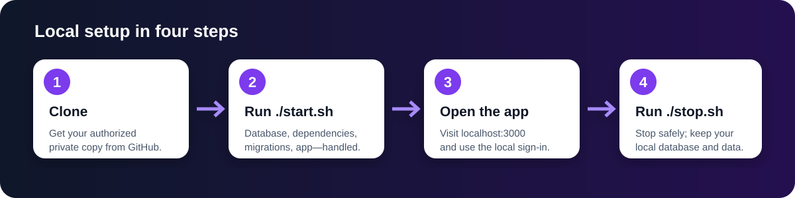
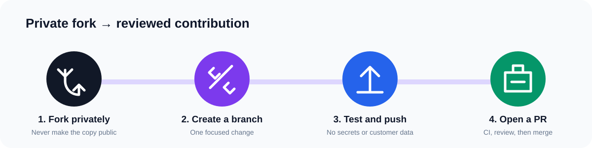
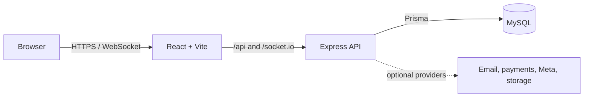

<div align="center">
  
  <h1>MooNsEstate</h1>
  <p>A private, full-stack real-estate CRM for leads, properties, conversations, billing, and team workflows.</p>

  [](https://github.com/schowdary75/MooNsEstate/actions/workflows/ci.yml)
  [](LICENSE)
  [](.nvmrc)
  [](SECURITY.md)
  [](https://github.com/schowdary75/MooNsEstate)
  [](https://github.com/schowdary75/MooNsEstate/fork)
</div>

> [!IMPORTANT]
> This is a private repository. Do not copy customer data, production database exports, API keys, passwords, `.env` files, or provider credentials into commits, issues, pull requests, screenshots, or logs.

## What is included

- React 19, TypeScript, Vite, Tailwind CSS, and accessible UI primitives
- Express 5 API with Prisma and MySQL
- Session authentication, CSRF checks, rate limiting, CORS, and security headers
- Tenant-aware CRM records, properties, conversations, billing, reporting, and integrations
- One-command local startup and shutdown for macOS, Linux, WSL, and Git Bash
- Automated tests, builds, dependency updates, and secret scanning

## Install locally

You only need:

1. [Git](https://git-scm.com/downloads)
2. [Node.js 22 LTS](https://nodejs.org/)
3. [Docker Desktop](https://www.docker.com/products/docker-desktop/) running
4. Bash: Terminal on macOS/Linux, WSL, or **Git Bash** on Windows



Open a terminal and run:

```bash
git clone https://github.com/schowdary75/MooNsEstate.git
cd MooNsEstate
./start.sh
```

Then open [http://localhost:3000](http://localhost:3000). The script:

- checks the required software;
- creates private, random local credentials on first run;
- starts a local MySQL container;
- installs the exact locked dependencies;
- applies database migrations;
- creates a local administrator; and
- starts both the web app and API in the background.

The generated sign-in is printed after startup and stored only in
`.moonestates/admin-credentials.txt`. Local configuration, logs, credentials,
uploads, and environment files are ignored by Git.

Stop everything safely:

```bash
./stop.sh
```

This stops only MooNsEstate processes and preserves the local database. To see
application logs, open `.moonestates/dev.log`.

### Windows notes

Open the cloned folder in Git Bash, not Command Prompt:

```bash
./start.sh
```

If Git reports that the script is not executable on macOS/Linux, run
`chmod +x start.sh stop.sh` once. If port `3306`, `3000`, or `5001` is already
used, stop the conflicting local service before retrying.

### Use an existing database

Advanced users can create `server/.env` from `server/.env.example` before
running `./start.sh`. The startup script never overwrites an existing
`server/.env`; in that case it uses the configured database and does not manage
the local MySQL container.

## Fork the repository



1. Open the repository on GitHub and select **Fork** in the upper-right corner.
2. Choose your account, keep the repository private, and select **Create fork**.
3. Clone your fork:

   ```bash
   git clone https://github.com/YOUR-USERNAME/MooNsEstate.git
   cd MooNsEstate
   git remote add upstream https://github.com/schowdary75/MooNsEstate.git
   ./start.sh
   ```

4. Create a focused branch:

   ```bash
   git switch -c feat/short-description
   ```

5. Commit, push, and open a pull request back to
   `schowdary75/MooNsEstate:main`.

Private-repository forking depends on the account and organization settings. If
GitHub does not show **Fork**, clone the repository, create a new private
repository in your account, and push your branch there. Never make a fork or
copy public.

## Development checks

Run the same checks used by continuous integration:

```bash
npm ci
npm run build
npm test --workspaces --if-present
npm run prisma:generate
npm run prisma:validate --workspace moonestates-server
```

The architecture is intentionally split into a browser client, an authenticated
API, and a private database:



## Contributing

Read [CONTRIBUTING.md](CONTRIBUTING.md) before opening a pull request. By
participating, you agree to [CODE_OF_CONDUCT.md](CODE_OF_CONDUCT.md).

- Use an issue for bugs or larger proposals.
- Keep one logical change per pull request.
- Add or update tests and documentation.
- Never include secrets or real customer data.
- Wait for CI and review before merging.

Useful links: [open an issue](https://github.com/schowdary75/MooNsEstate/issues/new/choose) ·
[view pull requests](https://github.com/schowdary75/MooNsEstate/pulls) ·
[star the project](https://github.com/schowdary75/MooNsEstate) ·
[fork privately](https://github.com/schowdary75/MooNsEstate/fork)

## Security and support

Do not report vulnerabilities in a public issue. Follow the private disclosure
process in [SECURITY.md](SECURITY.md). For normal questions, see
[SUPPORT.md](SUPPORT.md).

## License

Licensed under the [MIT License](LICENSE).
